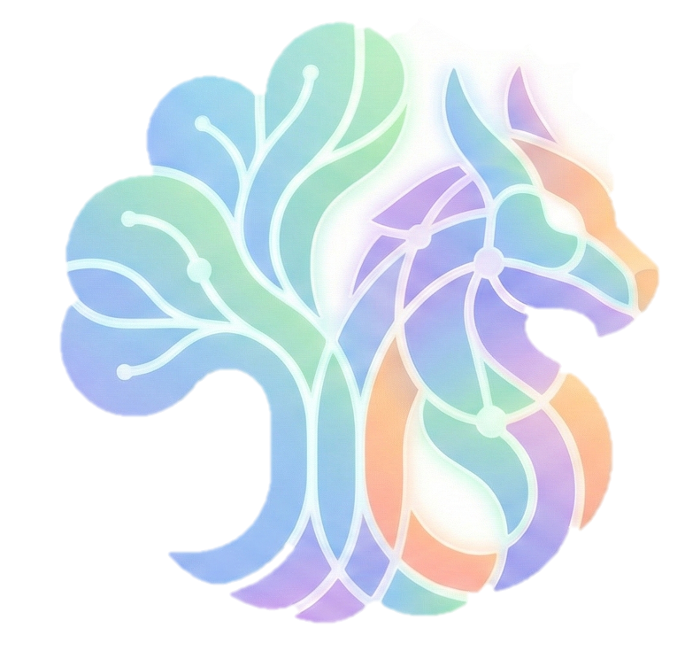

  

# Chimera

Chimera is an integrated toolkit for testing, validating, and exploring SMT solvers.  
It brings together techniques from three pulications:

1. **Once-for-All: Skeleton-Guided SMT Solver Fuzzing with LLM-Synthesized Generators**  
   Maolin Sun, Yibiao Yang, Yuming Zhou  
   *ASPLOS 2026*

2. **Validating SMT Rewriters via Rewrite Space Exploration Supported by Generative Equality Saturation**  
   Maolin Sun, Yibiao Yang, Jiangchang Wu, Yuming Zhou  
   *OOPSLA 2025*

3. **Validating SMT Solvers via Skeleton Enumeration Empowered by Historical Bug-Triggering Inputs**  
   Maolin Sun, Yibiao Yang, Ming Wen, Yongcong Wang, Yuming Zhou, Hai Jin  
   *ICSE 2023*

---

## Note

We are currently refactoring and integrating our tools into this project.
Please check back in a few days for a more complete version of this repository.
Thank you for your interest and understanding.
---

## Contribution

We welcome contributions and suggestions from both users and researchers.
Feel free to open issues or submit pull requests to help improve this project.

---

## License

Chimera is released under the MIT License.